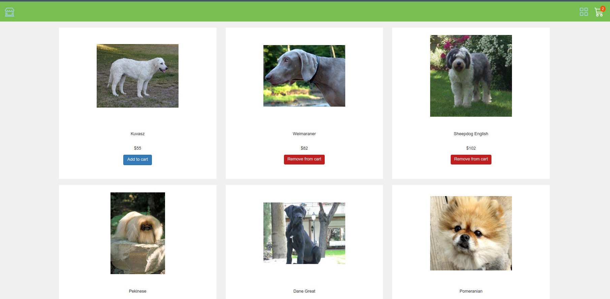
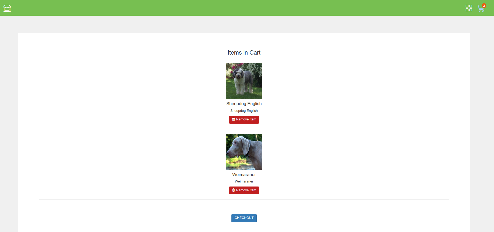

# Shopping cart (Using Redux Toolkit)

A project for exploring react toolkit.

## Requirements:

1. Fetch all product from api using (npx server-json 'path').
2. In case of failure we can get product from json file.
3. We can add & remove products from cart.
4. We can clear all items from cart.
5. Use state management library @reduxjs/toolkit for state management.

## Project Structure:

- We have all components in components folder.
- We have data, slices in data folder.
- We have our styling in styles folder.

## Some points need to be noted:

- Upcoming Enhancements are:
  - Checkout Page.
  - Search bar in Home screen.
  - Empty a Cart button.

## App Screens

**Product Page**

**Cart**

